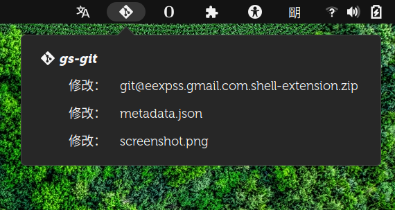

# gs-git

## monitor git directory for changes.

### Panel Icon
- Mouse 2, force refresh (re-read config file, check git dirs, refresh menu).
- Mouse 3, open configfile. config file is `~/.config/git-monitor.json`.

### Menu Item
- Directory: Mouse 1 opened in the Files(Nautilus), Mouse 3 open in the gnome-terminal.
- Files: opened with `git difftool`, eg `meld`.

